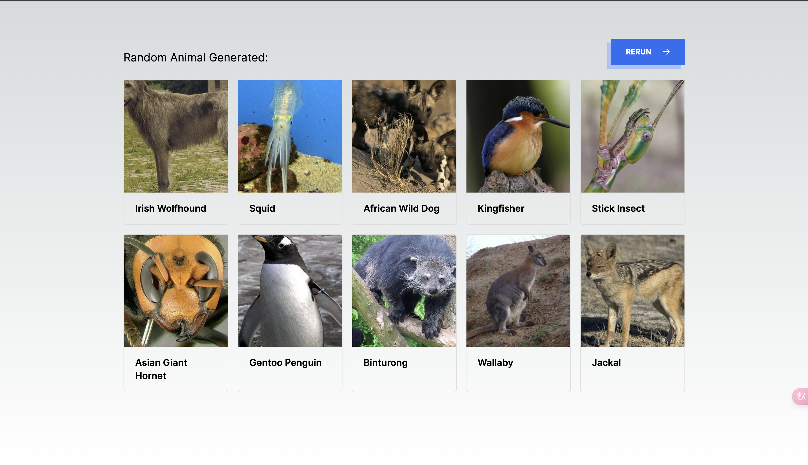

# Random Animal Generator

Random Animal Generator by [randomanimal-generator](https://randomanimal-generator.com).

You can directly deploy using Vercel.

## Live Demo

[https://randomanimal-generator.com](https://randomanimal-generator.com)



## Quick Start

1. clone project

```shell
git clone https://github.com/laohuoyan/randomanimal-generator
```

2. install dependencies

```shell
cd randomanimal-generator
pnpm install
```

3. local development

```shell
pnpm dev
```

open `http://localhost:3000` for preview

## Credit to

- [nextjs](https://nextjs.org/docs) for full-stack development
- [tailwindcss](https://tailwindcss.com/) for page building

## Other Things

you can contact me at Twitter: https://x.com/CoderLim